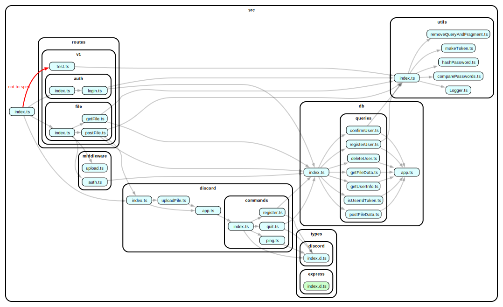

# Server

## API Endpoints

| URI             | Method | request                                           | response(success)                    |
| --------------- | ------ | ------------------------------------------------- | ------------------------------------ |
| `v1/hello`      | GET    | N/A 　　                                          | `send('Hello World!')`               |
| `v1/auth/login` | POST   | `body({userId, password})`                        | `json({ success: true, token: "" })` |
| `v1/file`       | GET    | `headers['authorization']` `query({userId, key})` | `download()`                         |
| `v1/file`       | POST   | `headers['authorization']` `multipart/form-data`  | `json({key})`                        |

## Source code dependent relationship visualization

